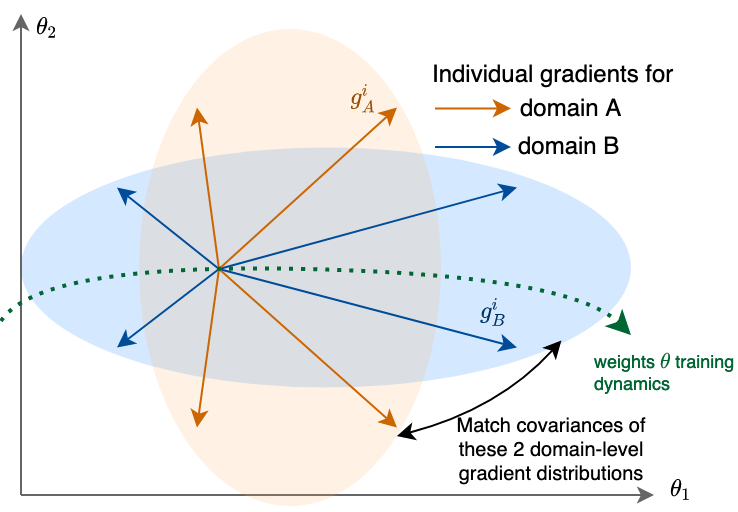

# Fishr: Invariant Gradient Variances for Out-of-distribution Generalization

Official PyTorch implementation of the Fishr regularization for out-of-distribution generalization | [paper](https://arxiv.org/abs/2109.02934)

[Alexandre Ramé](https://alexrame.github.io/), [Corentin Dancette](https://cdancette.fr/), [Matthieu Cord](http://webia.lip6.fr/~cord/)




## Abstract
Learning robust models that generalize well under changes in the data distribution is critical for real-world applications. To this end, there has been a growing surge of interest to learn simultaneously from multiple training domains - while enforcing different types of invariance across those domains. Yet, all existing approaches fail to show systematic benefits under fair evaluation protocols.

In this paper, we propose a new learning scheme to enforce domain invariance in the space of the gradients of the loss function: specifically, we introduce a regularization term that matches the domain-level variances of gradients across training domains. Critically, our strategy, named Fishr, exhibits close relations with the Fisher Information and the Hessian of the loss. We show that forcing domain-level gradient covariances to be similar during the learning procedure eventually aligns the domain-level loss landscapes locally around the final weights.

Extensive experiments demonstrate the effectiveness of Fishr for out-of-distribution generalization. In particular, Fishr improves the state of the art on the DomainBed benchmark and performs significantly better than
Empirical Risk Minimization.

# Installation

## Requirements overview

Our implementation relies on the [BackPACK](https://github.com/f-dangel/backpack/) package in [PyTorch](https://pytorch.org/) to easily compute gradient variances.

- python == 3.7.10
- torch == 1.8.1
- torchvision == 0.9.1
- backpack-for-pytorch == 1.3.0
- numpy == 1.20.2

## Procedure

1. Clone the repo:
```bash
$ git clone https://github.com/alexrame/fishr.git
```

2. Install this repository and the dependencies using pip:
```bash
$ conda create --name fishr python=3.7.10
$ conda activate fishr
$ cd fishr
$ pip install -r requirements.txt
```

With this, you can edit the Fishr code on the fly.

# Overview

This github enables the replication of our two main experiments: (1) on Colored MNIST in the setup defined by [IRM](https://github.com/facebookresearch/InvariantRiskMinimization/tree/master/code/colored_mnist) and (2) on the [DomainBed](https://github.com/facebookresearch/DomainBed/) benchmark.


## Colored MNIST in the IRM setup

We first validate that Fishr tackles distribution shifts on the synthetic Colored MNIST.
### Main results (Table 2 in Section 6.A)

To reproduce the results from Table 2, call ```python3 coloredmnist/train_coloredmnist.py --algorithm $algorithm``` where `algorithm` is either:
- ```erm``` for Empirical Risk Minimization
- ```irm``` for [Invariant Risk Minimization](https://arxiv.org/abs/1907.02893)
- ```rex``` for [Out-of-Distribution Generalization via Risk Extrapolation](https://icml.cc/virtual/2021/oral/9186)
- ```fishr``` for our proposed Fishr

Results will be printed at the end of the script, averaged over 10 runs. Note that all hyperparameters are taken from the seminal [IRM](https://github.com/facebookresearch/InvariantRiskMinimization/blob/master/code/colored_mnist/reproduce_paper_results.sh) implementation.

        Method | Train acc. | Test acc.  | Gray test acc.
       --------|------------|------------|----------------
        ERM    | 86.4 ± 0.2 | 14.0 ± 0.7 |   71.0 ± 0.7
        IRM    | 71.0 ± 0.5 | 65.6 ± 1.8 |   66.1 ± 0.2
        V-REx  | 71.7 ± 1.5 | 67.2 ± 1.5 |   68.6 ± 2.2
        Fishr  | 71.0 ± 0.9 | 69.5 ± 1.0 |   70.2 ± 1.1


### Without label flipping (Table 5 in Appendix C.2.3)
The script ```coloredmnist.train_coloredmnist``` also accepts as input the argument `--label_flipping_prob` which defines the label flipping probability. By default, it's 0.25, so to reproduce the results from Table 5 you should set `--label_flipping_prob 0`.
### Fishr variants (Table 6 in Appendix C.2.4)
This table considers two additional Fishr variants, reproduced with `algorithm` set to:
- ```fishr_offdiagonal``` for Fishr but without centering the gradient variances
- ```fishr_notcentered``` for Fishr but on the full covariance rather than only the diagonal

## DomainBed

DomainBed is a PyTorch suite containing benchmark datasets and algorithms for domain generalization, as introduced in [In Search of Lost Domain Generalization](https://arxiv.org/abs/2007.01434). Instructions below are copied and adapted from the official [github](https://github.com/facebookresearch/DomainBed/).

### Algorithms and hyperparameter grids

We added Fishr as a new algorithm [here](domainbed/algorithms.py), and defined Fishr's hyperparameter grids [here](domainbed/hparams_registry.py), as defined in Table 7 in Appendix D.

### Datasets

We ran Fishr on following [datasets](domainbed/datasets.py):

* Rotated MNIST ([Ghifary et al., 2015](https://arxiv.org/abs/1508.07680))
* Colored MNIST ([Arjovsky et al., 2019](https://arxiv.org/abs/1907.02893))
* VLCS ([Fang et al., 2013](https://openaccess.thecvf.com/content_iccv_2013/papers/Fang_Unbiased_Metric_Learning_2013_ICCV_paper.pdf))
* PACS ([Li et al., 2017](https://arxiv.org/abs/1710.03077))
* OfficeHome ([Venkateswara et al., 2017](https://arxiv.org/abs/1706.07522))
* A TerraIncognita ([Beery et al., 2018](https://arxiv.org/abs/1807.04975)) subset
* DomainNet ([Peng et al., 2019](http://ai.bu.edu/M3SDA/))

### Launch training

Download the datasets:

```sh
python3 -m domainbed.scripts.download\
       --data_dir=/my/data/dir
```

Train a model for debugging:

```sh
python3 -m domainbed.scripts.train\
       --data_dir=/my/data/dir/\
       --algorithm Fishr\
       --dataset ColoredMNIST\
       --test_env 2
```

Launch a sweep for hyperparameter search:

```sh
python -m domainbed.scripts.sweep launch\
       --data_dir=/my/data/dir/\
       --output_dir=/my/sweep/output/path\
       --command_launcher MyLauncher
       --datasets ColoredMNIST\
       --algorithms Fishr
```
Here, `MyLauncher` is your cluster's command launcher, as implemented in `command_launchers.py`.


### Performances inspection (Tables 3 and 4 in Section 6.B.2, Tables in Appendix G)

To view the results of your sweep:

````sh
python -m domainbed.scripts.collect_results\
       --input_dir=/my/sweep/output/path
````

We inspect performances using following [model selection criteria](domainbed/model_selection.py), that differ in what data is used to choose the best hyper-parameters for a given model:

* `OracleSelectionMethod` (`Oracle`): A random subset from the data of the test domain.
* `IIDAccuracySelectionMethod` (`Training`): A random subset from the data of the training domains.

Critically, Fishr performs consistently better than Empirical Risk Minimization.

Model selection | Algorithm | Colored MNIST | Rotated MNIST | VLCS | PACS         |OfficeHome      | TerraIncognita        | DomainNet       | Avg
-- | -- | -- | -- | -- | -- | -- | -- | -- | --
 |  |  |  |  |  |  |  |  |
Oracle | ERM | 57.8 ± 0.2 | 97.8 ± 0.1 | 77.6 ± 0.3 | 86.7 ± 0.3 | 66.4 ± 0.5 | 53.0 ± 0.3 | 41.3 ± 0.1 | 68.7
Oracle | Fishr | 68.8 ± 1.4  | 97.8 ± 0.1 | 78.2 ± 0.2 | 86.9 ± 0.2 | 68.2 ± 0.2 | 53.6 ± 0.4 | 41.8 ± 0.2 | 70.8
 |  |  |  |  |  |  |  |  |
Training | ERM | 51.5 ± 0.1 | 98.0 ± 0.0 |  77.5 ± 0.4 | 85.5 ± 0.2 | 66.5 ± 0.3 | 46.1 ± 1.8 | 40.9 ± 0.1 | 66.6
Training | Fishr | 52.0 ± 0.2 | 97.8 ± 0.0 | 77.8 ± 0.1 | 85.5 ± 0.4 | 67.8 ± 0.1 | 47.4 ± 1.6 | 41.7 ± 0.0 | 67.1


# Conclusion

We addressed the task of out-of-distribution generalization for computer vision classification tasks. We derive a new and simple regularization - Fishr - that matches the gradient variances across domains as a proxy for matching domain-level Hessians. Our scalable strategy reaches state-of-the-art performances on the DomainBed benchmark and performs better than ERM. Our empirical experiments suggest that Fishr regularization would consistently improve a deep classifier in real-world applications when dealing with data from multiple domains. If you need help to use Fishr, please open an issue or contact alexandre.rame@lip6.fr.

# Citation

If you find this code useful for your research, please consider citing our work (under review):

```
@article{rame2021ishr,
    title={Fishr: Invariant Gradient Variances for Out-of-distribution Generalization},
    author={Alexandre Rame and Corentin Dancette and Matthieu Cord},
    year={2021},
    journal={arXiv preprint arXiv:2109.02934}
}
```
